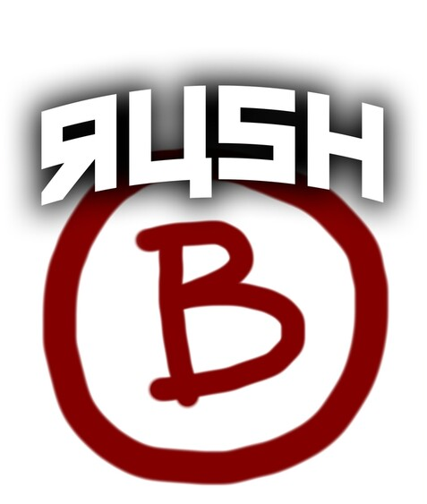

# rush-b
Brush yourself up! Rush-B ist ein einzigartiges "capture the flag", bzw. "capture the brush"-Erlebnis. Wir haben es zuerst auch nicht geglaubt, aber seht selbst!


## Inhalt
1. [Applikation](#applikation)
2. [Projektübersicht](#projektübersicht)

## Applikation
Eine Demo-Installation ist hier verfügbar: [https://rush-b.ch/](https://rush-b.ch/).

## Projektübersicht
### Meilensteine
| Meilenstein | Beschreibung                            | Status |
|----|--------------------------------------------------|:-------------:|
| M1  | [Anforderungsanalyse](doc/M1.md)                |   |
| M2  | [Erster Entwurf](doc/M2.md)                     |     |
| M3  | [Komplette Implementierung](doc/M3.md)          |     |
| M4  | [Finalisierung](doc/M4.md)                      |     |

## Prerequisite

- Docker
- Docker Compose

## Start Development Environment

```shell
docker compose -f docker-compose.dev.yml up
```

- Frontend will be available through: `localhost:5173`
- Backend will be available through: `localhost:8080` ( + `/ws`)

## Start Production Environment

```shell
docker compose -f docker-compose.prod.yml up
```

- Bundled App will be available on port `8080`

## Start Dev Environment locally without docker
```
npm i --prefix .\frontend\ i
npm run dev --prefix .\frontend\
```
OR
```
cd frontend
npm i
npm run dev

```
THEN:
```
http://localhost:5173/
```

0d870b6
920679a