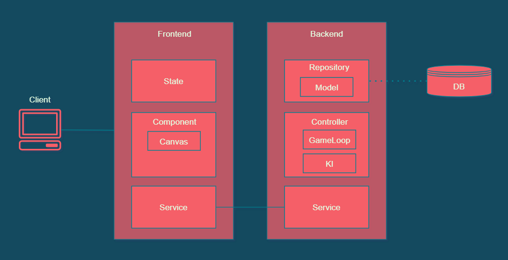

# Meilenstein 1

## Inhalt
1. [Rush-B](#rush-b)
2. [Anforderungen](#anforderungen)
3. [Roadmap](#roadmap)
4. [Abdeckung der Modulanforderungen](#abdeckung-der-modulanforderungen)
5. [Architektur](#architektur)
6. [Technologiestack](#technologiestack)

## Rush-B
### Beschreibung
Rush-B ist ein multiplayer-fähiges Jump&Run-Spiel in 2D. Im Zentrum steht aber nicht, sich durch möglichst viele Levels zu navigieren, sondern ein _capture-the-flag_-Mechanismus.  
Im Level befindet sich ein Pinsel, der erobert werden kann. Wenn ein Spieler im Besitz des Pinsels ist, kann dieser die Wände des Levels in seiner Farbe bemalen. 
Der Pinsel kann einem Gegner abgenommen werden, indem dieser K.O. geschlagen wird. Um die Spannung etwas zu erhöhen ist der Spieler, der über den Pinsel verfügt, etwas langsamer während er malt.  
Nach Ablauf einer bestimmten Zeit wird das Spiel beendet. Der Spieler, der die grösste Fläche bemalt hat, gewinnt.  
Das Spiel wird entweder gegen einen menschlichen Gegner oder gegen eine KI gespielt.  

_Fun Fact: Der Name des Spiels ist ein Wortspiel. Es handelt sich um ein Anagramm von "brush" (Pinsel). [Rush-B](https://www.urbandictionary.com/define.php?term=rush%20b) ist der Online-Gaming-Szene ein häufig verwendeter Topos._

### Spielregeln
#### Navigation
- Die Spielsteuerung erfolgt über die Tastatur
  - Gehen: [ARROW_LEFT], [ARROW_RIGHT]
  - Springen: [ARROW_UP], [SPACE]
  - Malen: [E] (sofern der Spieler im Besitz des Pinsels ist)
  - Gegner schlagen: [R] (sofern sich der Spieler unmittelbar beim Gegner befindet)
  - Spiel verlassen: [Q]
#### Spielmechanik
- Wenn Spieler in den Abgrund fallen, "sterben" sie. In diesem Fall werden sie nach einem Timeout von 2 Sekunden an einer zufälligen Stelle wiederbelebt.
- Spieler können sich gegenseitig schieben oder aufeinanderspringen.
- Der Pinsel wird automatisch aufgehoben, sobald ein Spieler sich in unmittelbarer Nähe befindet.
- Wenn ein Spieler malt, verlangsamt sich dieser um einen kleinen Faktor.
- Sollte der Pinsel "sterben" - z.B. wenn ein Spieler damit in den Abgrund fällt - wird der Pinsel nach 2 Sekunden an einer zufälligen Stelle wieder initialisiert.
- Die Spielzeit ist begrenzt. Nach 90 Sekunden ist die Runde beendet, sofern das Spiel nicht vorher abgebrochen wird.
- Der Spieler, der nach Ablauf des Timers die grösste Fläche in seiner Farbe bemalt hat, gewinnt. 
#### Ausserhalb des Game-Loops
- Lobby: User sehen andere User, die sich aktuell auf der Rush-B-Seite befinden (und ob diese verfügbar für ein Spiel sind).
- User können einander zu einem Spiel auffordern.
- User müssen nicht gegen andere User spielen. Alternativ können Sie eine Runde gegehn einen Bot (KI) spielen.
- An einem Spiel müssen genau zwei Spieler/KI's teilnehmen.

## Anforderungen
In den folgenden Abschnitten werden die funktionalen und nicht-funktionalen Anforderungen beschrieben (MUSS, KANN). Darauf folgen wenige Abgrenzungen, um den Rahmen dieses Projektes klarer zu umreissen.

### Funktionale Anforderungen
| ID | Funktionale Anforderung                                                      | Muss / Kann | Status |
|----|------------------------------------------------------------------------------|:-------------:|:-------------:|
| F01  | Der Spieler kann mit den Pfeiltasten navigieren.                               | M    |  |
| F02  | Beim Springen / Fallen ist der Spieler der Gravitation ausgesetzt.             | M    |  |
| F03  | Der Spieler kann den Pinsel aufnehmen und damit malen.                         | M    |  |
| F04  | Der malende Spieler verlangsamt sich um einen kleinen Faktor.                  | K    |  |
| F05  | Der Spieler kann mit seinem Gegner gemäss Beschreibung interagieren (schieben, darauf springen, K.O.-schlagen).        | M    |  |
| F06  | Spieler, die K.O. oder tot sind, werden nach 2 Sekunden wieder zum Leben erweckt.    | M    |  |
| F07  | Das Spiel wird nach Ablauf des Timers automatisch beendet.                     | M    |  |
| F08  | Der aktuelle Punktestand wird angezeigt und verändert sich abhängig der bemalten Wandfläche.   | M    |  |
| F09  | Das Spiel ist über das Internet gegen menschliche Gegner spielbar.             | M    |  |
| F10  | Das Spiel bietet eine KI als möglichen Gegner an.                              | M    |  |
| F11  | Im Spiel gibt es "kleine" Gegner, die sich gegen alle Spieler richten.         | K    |  |
| F12  | Im Spiel können Bonuspunkte gesammelt werden (z.B. mit Münzen).                | K    |  |
| F13  | Das Spiel erlaubt mehr als zwei Spieler pro Runde.                             | K    |  |
| F14  | Die Spieler sehen in der Lobby, welcher Spieler gerade verfügbar ist oder bereits spielt.    | M    |  |
| F15  | Die Spieler können in der Lobby miteinander chatten.                           | K    |  |
| F16  | Es wird eine Highscore über alle vergangenen Spiele geführt.                   | K    |  |
| F17  | Spieler können einen eigenen Avatar wählen.                                    | K    |  |
| F18  | Spieler können einen eigenen Nicknamen wählen.                                 | K    |  |
| F19  | Spieler können eine eigene Farbe wählen.                                       | K    |  |
| F20  | Der Browser merkt sich personalisierte Eingaben (Nickname, Farbe).             | K    |  |
| F21  | Es sind mehrere Levels verfügbar.                                              | K    |  |

### Nicht-funktionale Anforderungen
| ID | Nicht-funktionale Anforderung                                                | Muss / Kann | Status |
|----|------------------------------------------------------------------------------|:-------------:|:-------------:|  
| Q01  | Das Leveldesign ist ansprechend gestaltet.                                     | M    |  |
| Q02  | Spieler und Pinsel werden nicht an sinnlosen Stellen initialisiert.            | K    |  |
| Q03  | Spieler können sich nicht durch solide Objekte (wie Wände) bewegen.            | M    |  |
| Q04  | Die Performance ist flüssig, kein "Stocken" ist feststellbar.                  | K    |  |
| Q05  | Es sind mehrere Levels verfügbar.                                              | K    |  |
| Q06  | Die Spielfiguren werden animiert (z.B. bewegte Beinchen wenn ein Spieler geht).   | M   |  |
| Q07  | Heroku-Deployments werden bei jedem Commit automatisiert gemacht.              | M    |  |
| Q08  | Frontend und Backend-Implementierungen werden sauber getrennt.                 | M    |  |
| Q09  | Backend-Quellcode wird kommentiert, sofern sinnvoll.                           | M    |  |
| Q10  | Frontend-Quellcode wird kommentiert, sofern sinnvoll.                          | K    |  |
| Q11  | Unit-Tests werden für die relevanten Backend-Implementierungen erstellt.       | M    |  |
| Q12  | Unit-Tests werden für die relevanten Frontend-Implementierungen erstellt.      | K    |  |
| Q13  | Error-Handling wird sinnvoll umgesetzt (Backend und Frontend).                 | M    |  |
| Q14  | Dockerisierung der Applikkation.                                               | K    |  |
| Q15  | Das Spiel macht Spass!                                                         | K    |  |
| Q16  | Audio                                                                          | K    |  |

### Abgrenzung
- Aufgrund der kurzen Runden sind keine Checkpoints nötig.
- Es muss nicht die ganze Wandfläche bemalt werden können (unerreichbare Stellen sind erlaubt).
- Aufgrund der kurzen Spieldauer wird eine Persistenzschicht initial als "nice to have" und somit als vernachlässigbar betrachtet. 

## Roadmap
| ID | Task                                                     | Target | Lead | Status |
|----|--------------------------------------------------------------------------|----|---|:-------------:|
| T01  | Erstellung Projekt-Skeleton                                  | M1 | Oli |  |
| T02  | Erstellung GitHub-Repository & Heroku-Account                | M1 | Oli |  |
| T03  | Automatisches Deployment bei Push                            | M1 | Oli |  |
| T04  | Dokumentation Meilenstein 1                                  | M1 | Lena |  |
| T05  | Schnittstellendesign                                         | M1 | Oli & Lena |  |
| T06  | Erstimplementierung Gameplay (Navigation, Gravitation, Collision Detection)  | M2 | Lena |  |
| T07  | Erstimplementierung UI (Game)                                | M2 | Oli |  |
| T08  | Erstimplementierung Schnittstellen (Game)                    | M2 | Oli & Lena |  |
| T09  | Dokumentation Meilenstein 2                                  | M2 | Lena |  |
| T10  | Erweiterung Gameplay (Spielerinteraktion, Timer, Malen)      | M3 | Lena |  |
| T11  | Erweiterung UI (Fancy Design, Lobby)                         | M3 | Oli |  |
| T12  | Erweiterung UI (Avatare, Sprite Sheets)                      | M3 | Lena |  |
| T13  | Erweiterung Gameplay (Lobby)                                 | M3 | Oli & Lena |  |
| T14  | Erweiterung Schnittstellen                                   | M3 | Oli & Lena |  |
| T15  | Unit Tests                                                   | M3 | Oli & Lena |  |
| T16  | Implementierung KI                                           | M3 | Lena |  |
| T17  | Training KI                                                  | M3 | Lena |  |
| T18  | Evaluation KI                                                | M3 | Lena |  |
| T19  | Dokumentation Meilenstein 3                                  | M3 | Lena |  |
| T20  | Features (Optional)                                          | M4 | Oli & Lena |  |
| T21  | Dockerisierung (Optional)                                    | M4 | Oli |  |
| T22  | Dokumentation Quellcode Backend                              | M4 | Lena |  |
| T23  | Dokumentation Quellcode Frontend                             | M4 | Oli |  |
| T24  | Schlusspräsentation                                          | M4 | Oli & Lena |  |
| T25  | Dokumentation Meilenstein 4                                  | M4 | Lena |  |

## Abdeckung der Modulanforderungen
Es folgt eine Einschätzung, inwieweit das Spiel die Anforderungen zur Projektarbeit erfüllt. Als Ausgangspunkt werden die Anforderungen aus der ersten PVA genommen.

### Komplexität des Spiels
Die Spielmechanik orientiert sich an klassischen Beispielen und sollte den Modulstoff in folgenden Punkten abdecken:
- Sprite Sheets
- Implementierung von Gravitation
- Collision Detection
- Tile Maps
- Interaktion zwischen zwei Spielern
- Punktevergabe
- Timer

### Umsetzung und Evaluation eines KI-Spielers
#### Umsetzung
Da das Gameplay gewisse Freiheitsgrade hat, wird Reinforcement Learning eingesetzt, konkret der Genetische Algorithmus mit einem Neuronalen Netz.
Dafür wird eine eigene [Library](https://github.com/lpapailiou/neuralnetwork) als Plug-In implementiert.  
Als Input werden folgende Parameter gelten:
- Position des KI-Spielers
- Position des Gegners
- Position des Pinsels
- Besitz des Pinsels (Boolean)
- Sicht in vier Richtungen (Hindernis Oben/Rechts/Unten/Links)
- Optional: Indikator, ob sich ein Abgrund in der Nähe befindet

Output:
- Tastaturbefehle analog Input eines menschlichen Spielers

Parameter Fitness-Funktion: 
- Bemalte Fläche - bemalte Fläche des Gegners (Punktestand)
- ggf. weitere Parameter wie Besitz des Pinsels

#### Evaluation
Die Evaluation wird quantitativ mit Hilfe der Fitnessfunktion durchgeführt. Ein Vergleich mit einem Zufallsbot als Ground Truth
erachten wir als weniger sinnvoll, weil die Kombination und möglichen Sequenzen der Tastaturbefehle nach Zufall höchstwahrscheinlich 
nicht einen guten Referenzwert bilden würden.  
Die qualitative Evaluation erfolgt visuell in Testspielen.

### Ansprechendes und intuitives GUI
Mit dem Jump&Run-Gameplay und dem Kachelbasierten Leveldesign ist es naheliegend, dass das GUI-Design sich an Pixel-Art orientiert.  
Während der ersten Phase wird auf öffentlich zugängliche Sprite Sheets zugegriffen. Später sollen - je nach Fortschritt und Kapazität - eigene
Designs für Level und Avatare erstellt werden. Hier sind wir allerdings durch unsere künstlerischen Fähigkeiten begrenzt ;).  
Da sich das Spielthema mit "Malen" befasst, soll darauf geachtet werden, dass die Farbwahl angenehm ist.  
Die Spielsteuerung (Lobby, Buttons) soll sich harmonisch im Design einfügen.

### Bonus: Verteiltes Mehrbenutzer-Spiel
Eine verteilte Implementierung ist von Beginn an geplant und gegeben.  
Als Abgrenzung wird eine Verteilung (und Umsetzung) einer Persistenzschicht als _nice to have_ und somit als optional eingestuft. Dies, weil
die Spielrunden allgemein relativ kurz sind und daher für den Spieler kein eigentlicher Mehrwert aus dem Zwischenspeichern der Spiele entsteht.  
Einzig die Highscore sowie ggf. persönliche Einstellungen könnten möglicherweise persistiert werden.

### Weitere Anforderungen
In der PVA wurden ferner folgende Anforderungen kommuniziert:
- Vollständigkeit und rechtzeitige Abgabe der Meilensteine
- Vollständige Umsetzung gemäss Anforderungen
- Fehlerhandling und Code-Qualität
- Abschlusspräsentation und Demo

Hier wollen wir den Tag nicht vor dem Abend loben. Aber wir geben unser Bestes :).

## Architektur
Die Design-Grundbausteine (Auf Architekturebene)
//TODO

## Technologiestack
Abschliessend werden die Tools und Technolgien genannt, die in diesem Projekt eingesetzt werden sollen:
### Backend
- Server: Spring Boot
- Programmiersprachen: Kotlin, Java

### Frontend
- ? (Oli? :))
- JS
- HTML
- CSS
- Canvas

### Kommunikation
- Client/Server: Websocket
- Team: Whatsapp, Teams

### Persistenz
Bisher optional. Falls später eingesetzt:
- Server: PostreSQL
- Client: LocalStorage

### Deployment
- IDE: IntelliJ 
- Applikations-Hosting: Heroku
- Quellcode-Hosting: GitHub
- Versionierung: Git

### Dokumentation
- Markdown-Files, in diesem Repository integriert.

