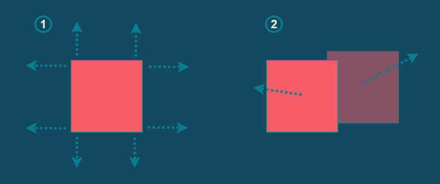

# Meilenstein 2

## Inhalt

1. [Übersicht](#übersicht)
2. [Projektstand](#projektstand)
3. [Roadmap](#roadmap)
4. [Design](#design)

## Übersicht

### Wichtigste Änderungen
Mit dem zweiten Meilenstein lässt sich nun die Figur mit Hilfe von Tastaturbefehlen steuern. Die Bewegungen sind im
Browser sichtbar.

Die erste "Spiellogik" die Implementiert wurde ist Collision Detection. Diese wurde auf zwei Arten implementiert:

1. Da das Level aus einer Tile-Map besteht, wird dieses als Matrix repräsentiert. Feste Blöcke werden durch eine "1" angegeben, leerer Raum durch eine "0". Die Kollisionen mit den festen Blöcken werden rein rechnerisch detektiert, indem die Kanten der Figur analog der Abbildung unten (linke Seite) gegen die Levelstruktur geprüft werden.
2. Da Figuren untereinander auch kollidieren können, braucht es auch hier Collision Detection. Die Figuren werden durch Rechtecke repräsentiert. Wenn sie sich überschneiden, werden die jeweiligen Geschwindigkeitsvektoren entsprechend angepasst, so dass sich die Figuren abstossen (Abbildung unten, rechte Seite). Hierfür wurde eine [Anleitung](https://spicyyoghurt.com/tutorials/html5-javascript-game-development/collision-detection-physics) aus dem Moodle-Kurs verwendet. Hier wird es noch einen Feinschliff brauchen.

### Erfüllung der Meilenstein-Anforderungen
#### 1. Füge einen Raum in dein Spiel ein, in dem du eine Figur positionieren kannst
Das Level ist durch eine navigierbare Tile-Map gegeben, die durch eine Matrix repräsentiert wird.
#### 2. Programmiere die Steuerung, damit die Bewegung der Figur durch Maus oder Tastatur gesteuert werden kann
Die Figur kann sich mit Hilfe von Tastaturbefehlen in der TileMap bewegen.
#### 3. Füge in das Level NPC und Raum-Elemente ein
Zwei Figurtypen lassen sich aktuell implementieren: Spielbare Figuren sowie NPC's, wobei sich letztere zufällig durch das Level bewegen.

## Projektstand

In den folgenden Abschnitten werden die funktionalen und nicht-funktionalen Anforderungen beschrieben (MUSS, KANN).

### Funktionale Anforderungen

| ID  | Funktionale Anforderung                                                                                         | Muss / Kann |              Status               |
|-----|-----------------------------------------------------------------------------------------------------------------|:-----------:|:---------------------------------:|
| F01 | Der Spieler kann mit den Pfeiltasten navigieren.                                                                |      M      |  |
| F02 | Beim Springen / Fallen ist der Spieler der Gravitation ausgesetzt.                                              |      M      |  |
| F03 | Der Spieler kann den Pinsel aufnehmen und damit malen.                                                          |      M      |  |
| F04 | Der malende Spieler verlangsamt sich um einen kleinen Faktor.                                                   |      K      |  |
| F05 | Der Spieler kann mit seinem Gegner gemäss Beschreibung interagieren (schieben, darauf springen).                |      M      |  |
| F06 | Spieler, die K.O. oder tot sind, werden nach 2 Sekunden wieder zum Leben erweckt.                               |      K      |  |
| F07 | Das Spiel wird nach Ablauf des Timers automatisch beendet.                                                      |      M      |  |
| F08 | Der aktuelle Punktestand wird angezeigt und verändert sich abhängig der bemalten Wandfläche.                    |      M      |  |
| F09 | Das Spiel ist über das Internet gegen menschliche Gegner spielbar.                                              |      M      |  |
| F10 | Das Spiel bietet eine KI als möglichen Gegner an.                                                               |      M      |  |
| F11 | Im Spiel gibt es «kleine» Gegner, die sich gegen alle Spieler richten.                                          |      K      |  |
| F12 | Im Spiel können Bonuspunkte gesammelt werden (z.B. mit Münzen).                                                 |      K      |  |
| F13 | Das Spiel erlaubt mehr als zwei Spieler pro Runde.                                                              |      K      |  |
| F14 | Die Spieler sehen in der Lobby, welcher Spieler gerade verfügbar ist oder bereits spielt.                       |      M      |  |
| F15 | Die Spieler können in der Lobby miteinander chatten.                                                            |      K      |  |
| F16 | Es wird eine Highscore über alle vergangenen Spiele geführt.                                                    |      K      |  |
| F17 | Spieler können einen eigenen Avatar wählen.                                                                     |      K      |  |
| F18 | Spieler können einen eigenen Nicknamen wählen.                                                                  |      K      |  |
| F19 | Spieler können eine eigene Farbe wählen.                                                                        |      K      |  |
| F20 | Der Browser merkt sich personalisierte Eingaben (Nickname, Farbe).                                              |      K      |  |
| F21 | Es sind mehrere Levels verfügbar.                                                                               |      K      |  |

### Nicht-funktionale Anforderungen

| ID  | Nicht-funktionale Anforderung                                                   | Muss / Kann |               Status                |
|-----|---------------------------------------------------------------------------------|:-----------:|:-----------------------------------:|
| Q01 | Das Leveldesign ist ansprechend gestaltet.                                      |      M      |    |
| Q02 | Spieler und Pinsel werden nicht an sinnlosen Stellen initialisiert.             |      K      |    |
| Q03 | Spieler können sich nicht durch solide Objekte (wie Wände) bewegen.             |      M      |    |
| Q04 | Die Performance ist flüssig, kein «Stocken» ist feststellbar.                   |      K      |    |
| Q05 | Es sind mehrere Levels verfügbar.                                               |      K      |    |
| Q06 | Die Spielfiguren werden animiert (z.B. bewegte Beinchen wenn ein Spieler geht). |      M      |    |
| Q07 | Deployments werden bei jedem Commit automatisiert gemacht.               |      M      |  |
| Q08 | Frontend und Backend-Implementierungen werden sauber getrennt.                  |      M      |    |
| Q09 | Backend-Quellcode wird kommentiert, sofern sinnvoll.                            |      K      |    |
| Q10 | Frontend-Quellcode wird kommentiert, sofern sinnvoll.                           |      K      |    |
| Q11 | Unit-Tests werden für die relevanten Backend-Implementierungen erstellt.        |      K      |    |
| Q12 | Unit-Tests werden für die relevanten Frontend-Implementierungen erstellt.       |      K      |    |
| Q13 | Error-Handling wird sinnvoll umgesetzt (Backend und Frontend).                  |      M      |    |
| Q14 | Dockerisierung der Applikation.                                                 |      K      |    |
| Q15 | Das Spiel macht Spass!                                                          |      K      |    |
| Q16 | Audio                                                                           |      K      |    |
| Q17 | Internationalisierung (Mehrsprachigkeit)                                        |      K      |    |

## Roadmap

| ID  | Task                                                                        | Target | Lead       |                Status                 |
|-----|-----------------------------------------------------------------------------|--------|------------|:-------------------------------------:|
| T01 | Erstellung Projekt-Skeleton                                                 | M1     | Oli        |    |
| T02 | Erstellung GitHub-Repository & Google-Account                               | M1     | Oli        |  |
| T03 | Automatisches Deployment bei Push                                           | M1     | Oli        |  |
| T04 | Schnittstellendesign  (initial)                                             | M1     | Oli & Lena |  |
| T05 | Dokumentation Meilenstein 1                                                 | M1     | Lena       |  |
| T06 | Erstimplementierung Gameplay (Navigation, Gravitation, Collision Detection) | M2     | Lena       |      |
| T07 | Erstimplementierung UI (Game)                                               | M2     | Oli        |      |
| T08 | Erstimplementierung Schnittstellen (Game)                                   | M2     | Oli & Lena |      |
| T09 | Dokumentation Meilenstein 2                                                 | M2     | Lena       |      |
| T10 | Erweiterung Gameplay (Spielerinteraktion, Timer, Malen)                     | M3     | Lena       |      |
| T11 | Erweiterung UI (Fancy Design, Lobby)                                        | M3     | Oli        |      |
| T12 | Erweiterung UI (Avatare, Sprite Sheets)                                     | M3     | Lena       |      |
| T13 | Erweiterung Gameplay (Lobby)                                                | M3     | Oli & Lena |      |
| T14 | Erweiterung Schnittstellen                                                  | M3     | Oli & Lena |      |
| T15 | Unit Tests                                                                  | M3     | Oli & Lena |      |
| T16 | Implementierung KI                                                          | M3     | Lena       |      |
| T17 | Training KI                                                                 | M3     | Lena       |      |
| T18 | Evaluation KI                                                               | M3     | Lena       |      |
| T19 | Dokumentation Meilenstein 3                                                 | M3     | Lena       |      |
| T20 | Features (Optional)                                                         | M4     | Oli & Lena |      |
| T21 | Dockerisierung (Optional)                                                   | M4     | Oli        |      |
| T22 | Dokumentation Quellcode Backend                                             | M4     | Lena       |      |
| T23 | Dokumentation Quellcode Frontend                                            | M4     | Oli        |      |
| T24 | Schlusspräsentation                                                         | M4     | Oli & Lena |      |
| T25 | Dokumentation Meilenstein 4                                                 | M4     | Lena       |      |

## Design

### Architektur

#### Frontend
Da das Frontend mit Typescript typesafe ist, haben wir auf dieser Seite noch von einer Komponentenarchitektur abgesehen. Vorerst
werden hier alle Figuren als "Character" behandelt. Da das Frontend nur visualisieren muss, sehen wir durch die Architektur auch keine Nachteile.

#### Backend
Mit dem Dazukommen von NPC's wurde mit Vererbung experimentiert. Folgende Punkte waren wichtig:

- Daten sollen von Funktionen getrennt werden (Model vs. Controller.
- Funktionalitäten sollen nicht redundant geschrieben werden.

Nach einigen Refactoring-Sessions haben wir doch die Vererbung beibehalten. Zusätzlich wurde mit Interfaces eine Komponentenbasierte Architektur implementiert, 
die mit dem nächsten Meilenstein zum Zug kommen wird. Hier wird das Verhalten von Spielfiguren und NPC's weiter differenziert werden (Punkte machen, Malen).

### Protokoll

Das Design des Webservice-Protokolls wird im _living document_ [Protokoll](https://github.com/Level8Broccoli/rush-b/blob/main/doc/_protocol.md) geführt.

### Technologiestack

Der Technolgiestack ist soweit unverändert.

### Code-Repository

Das Code-Repository kann unter [https://github.com/Level8Broccoli/rush-b](https://github.com/Level8Broccoli/rush-b) eingesehen werden.
