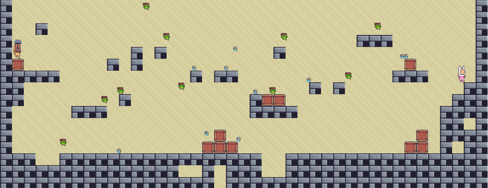

# Meilenstein 3

## Inhalt

1. [Übersicht](#übersicht)
2. [Projektstand](#projektstand)
3. [Roadmap](#roadmap)
4. [Design](#design)

## Übersicht

### Wichtigste Änderungen
In diesem Meilenstein wurden drei wichtige funktionale Schwerpunkte angegangen: Gameplay & Design, Implementierung der Lobby und KI.

#### Gameplay & Design
Sämtliche anstehenden Funktionalitäten innerhalb des Spieles wurden implementiert:  

- Spieler können einen Pinsel aufheben und Malen
- Spieler können andere Gegner schlagen, wobei allfällig gehaltene Pinsel weggeschleudert werden (das Schlagen erfolgt implizit durch Kollisionen)
- Es gibt KI-getriebene Gegner (vgl. entsprechenden Abschnitt)
- Das Spiel wird nach 2 Minuten terminiert
- Die Punkte werden abhängig der Malfläche zusammengezählt
- Das Level wurde designt und wird mit unterschiedlichen Tiles visualisiert

  

Auf Backend- sowie Frontend-Seite gibt es noch diverse Gelegenheiten für Feinschliffe. Diese werden in der kommenden Iteration angegangen.

#### Implementierung der Lobby

TODO

#### Implementierung der KI
Die Umsetzung eines KI-Gegners wurde mit Reinforccement Learning (mit dem Genetischen Algorithmus mit einem Neuronalen Netz,
mittels eigener Library [Library](https://github.com/lpapailiou/neuralnetwork) als Plug-In) implementiert.  

Als Input-Vektor wurden folgende binäre Parameter gewählt:

- ``0-3`` :  Kollisionen mit der Wand (je ein Indikator pro Richtung)
- ``4-7`` :  Nähe zu einem Pinsel (je ein Indikator pro Richtung)
- ``8`` :  Indikator, ob Pinsel gehalten wird 
- ``9`` :  Indikator, ob Kachel bereits besucht wurde
- ``10-11`` :  Geschwindigkeitsvektor
- ``12-13`` :  Positionsvektor

Ferner wurde auch mit zusätzlichen Parametern gearbeitet (Nähe zu anderen Charakteren, Nähe zu NPC's), welche
aber aufgrund mangelnder Resultate verworfen wurden.

Als Input wurden folgende Aktionen codiert:

- ``0`` :  nach links gehen
- ``1`` :  nach rechts gehen
- ``2`` :  springen

Die Aktion 'Malen' ist per Default aktiv, wobei diese nur greift sofern die KI auch im Besitz eines Pinsels ist.  
  
Die Fitness-Funktion wird als Summe folgender Parameter implementiert:  

- ``+1`` :  bei jedem Schritt, bei dem die KI im Besitz des Pinsels ist
- ``+10`` :  bei jedem Schritt, bei welchem die Figur in Bewegung ist (und nicht mit einer Wand kollidiert)
- ``+100 * Anzahl besuchte Kacheln`` :  am Ende des Spiels
- ``+1000000 * Anzahl bemalter Kacheln`` :  am Ende des Spiels

Trainingsumgebung:  
  
Ein Trainingsspiel umfasst eine KI, einen Random-Bot als Gegner, 10 Pinsel und 10 Npc's.  
  
Die Evaluation wurde quantitativ mit Hilfe der Fitnessfunktion durchgeführt. Exemplarische Ergebnisse:  

``
2022-11-06 17:21:55.719  INFO 8496 --- [       Thread-1] Generation logger      : generation #0: 	 fitness: 	 48003050  
2022-11-06 17:22:03.266  INFO 8496 --- [       Thread-1] Generation logger      : generation #1: 	 fitness: 	 39003671  
2022-11-06 17:22:10.188  INFO 8496 --- [       Thread-1] Generation logger      : generation #2: 	 fitness: 	 55001539  
2022-11-06 17:22:18.011  INFO 8496 --- [       Thread-1] Generation logger      : generation #3: 	 fitness: 	 67000670  
2022-11-06 17:22:24.718  INFO 8496 --- [       Thread-1] Generation logger      : generation #4: 	 fitness: 	 53003572  
2022-11-06 17:22:31.028  INFO 8496 --- [       Thread-1] Generation logger      : generation #5: 	 fitness: 	 42000931  
2022-11-06 17:22:37.450  INFO 8496 --- [       Thread-1] Generation logger      : generation #6: 	 fitness: 	 55003069  
2022-11-06 17:22:44.126  INFO 8496 --- [       Thread-1] Generation logger      : generation #7: 	 fitness: 	 64004192  
2022-11-06 17:22:50.535  INFO 8496 --- [       Thread-1] Generation logger      : generation #8: 	 fitness: 	 65003774  
2022-11-06 17:22:58.731  INFO 8496 --- [       Thread-1] Generation logger      : generation #9: 	 fitness: 	 68002328  
2022-11-06 17:23:05.299  INFO 8496 --- [       Thread-1] Generation logger      : generation #10: 	 fitness: 	 63002230  
2022-11-06 17:23:11.843  INFO 8496 --- [       Thread-1] Generation logger      : generation #11: 	 fitness: 	 62002626  
2022-11-06 17:23:18.381  INFO 8496 --- [       Thread-1] Generation logger      : generation #12: 	 fitness: 	 67003615  
2022-11-06 17:23:25.005  INFO 8496 --- [       Thread-1] Generation logger      : generation #13: 	 fitness: 	 52002745  
2022-11-06 17:23:31.684  INFO 8496 --- [       Thread-1] Generation logger      : generation #14: 	 fitness: 	 54004139  
2022-11-06 17:23:38.329  INFO 8496 --- [       Thread-1] Generation logger      : generation #15: 	 fitness: 	 91004519  
2022-11-06 17:23:45.567  INFO 8496 --- [       Thread-1] Generation logger      : generation #16: 	 fitness: 	 81000450  
2022-11-06 17:23:53.768  INFO 8496 --- [       Thread-1] Generation logger      : generation #17: 	 fitness: 	 76003179  
2022-11-06 17:24:00.468  INFO 8496 --- [       Thread-1] Generation logger      : generation #18: 	 fitness: 	 81006140  
2022-11-06 17:24:07.123  INFO 8496 --- [       Thread-1] Generation logger      : generation #19: 	 fitness: 	 98001399  
``

Die quantitativen Ergebnisse zeigen tatsächlich eine Lernkurve, die aber relativ unstetig ist. Visuelle Kontrollen zeigten leider, 
dass die KI unbrauchbar scheint. Insgesamt zwei Tage wurden in das Training mit unterschiedlichen Konfigurationen investiert,
wobei das beste Resultat ein auf- und ab springender Bot war.  
Dieser hat im Vergleich zum Random-Bot wesentlich schlechter abgeschnitten.  
Aus diesem Grund fiel die Entscheidung, den Random-Bot als KI-Gegner in Spielen zur Verfügung zu stellen.  
  
Wieso war die Implementierung der Reinforcement-KI nicht erfolgreich? Wir vermuten unterschiedliche Ursachen:

- Die getesteten Parametrierungen waren schlicht unpassend.
- Reinforcement Learning greift sehr gut, wenn Strategien abhängig von Parametern gelernt werden müssen. Dies funktioniert sehr gut bei Spielen wie Snake oder Flappy Bird. Bei unserem Spiel beruht ein grosser Teil auf Exploration (d.h. unterschiedliche Aktionen folgen auf gleiche Inputs), was in unserem Fall möglicherweise eine zu komplexe Anforderung an die KI ist.
  
Zusätzlich wurde den NPC's etwas "KI" eingehaucht. Sie verhalten sich in neutralem Umfeld wie der Random Bot.
Befinden sie sich aber in der Nähe eines Spielers (Random Bot oder menschlicher Gegner), greifen sie diesen
entweder an oder flüchten.  

### Erfüllung der Meilenstein-Anforderungen
#### 1. Reichere die Umgebung mit Hindernissen an, mit denen die Spielfiguren kollidieren
Das Level wurde so designt, dass sich der Spieler durch eine interessante Umgebung bewegen kann. Es gibt Hindernisse,
Blöcke auf die man Springen kann und kleine Gruben.
#### 2. Reichere die Umgebung mit Elementen an, mit denen die Spielfigur interagieren kann (Items zum Aufnehmen, Schalter zum Betätigen)
Umgesetzt wurden "Pinsel" (die aktuell eher wie kleine Pilze oder Schildkröten aussehen), die ein Spieler aufnehmen und wieder verlieren kann.
#### 3. Erweitere das Bewegungsrepertoire deiner Figur mit neuen Aktionen, z.B. Springen, Schiessen, Schieben
Ist eine Spielfigur im Besitz eines Pinsels, kann sie den Hintergrund in ihrer Farbe bemalen.

## Projektstand

In den folgenden Abschnitten werden die funktionalen und nicht-funktionalen Anforderungen beschrieben (MUSS, KANN).

### Funktionale Anforderungen

| ID  | Funktionale Anforderung                                                                                         | Muss / Kann |              Status               |
|-----|-----------------------------------------------------------------------------------------------------------------|:-----------:|:---------------------------------:|
| F01 | Der Spieler kann mit den Pfeiltasten navigieren.                                                                |      M      |  |
| F02 | Beim Springen / Fallen ist der Spieler der Gravitation ausgesetzt.                                              |      M      |  |
| F03 | Der Spieler kann den Pinsel aufnehmen und damit malen.                                                          |      M      |  |
| F04 | Der malende Spieler verlangsamt sich um einen kleinen Faktor.                                                   |      K      |  |
| F05 | Der Spieler kann mit seinem Gegner gemäss Beschreibung interagieren (schieben, darauf springen).                |      M      |  |
| F06 | Spieler, die K.O. oder tot sind, werden nach 2 Sekunden wieder zum Leben erweckt.                               |      K      |  |
| F07 | Das Spiel wird nach Ablauf des Timers automatisch beendet.                                                      |      M      |  |
| F08 | Der aktuelle Punktestand wird angezeigt und verändert sich abhängig der bemalten Wandfläche.                    |      M      |  |
| F09 | Das Spiel ist über das Internet gegen menschliche Gegner spielbar.                                              |      M      |  |
| F10 | Das Spiel bietet eine KI als möglichen Gegner an.                                                               |      M      |  |
| F11 | Im Spiel gibt es «kleine» Gegner, die sich gegen alle Spieler richten.                                          |      K      |  |
| F12 | Im Spiel können Bonuspunkte gesammelt werden (z.B. mit Münzen).                                                 |      K      |  |
| F13 | Das Spiel erlaubt mehr als zwei Spieler pro Runde.                                                              |      K      |  |
| F14 | Die Spieler sehen in der Lobby, welcher Spieler gerade verfügbar ist oder bereits spielt.                       |      M      |  |
| F15 | Die Spieler können in der Lobby miteinander chatten.                                                            |      K      |  |
| F16 | Es wird eine Highscore über alle vergangenen Spiele geführt.                                                    |      K      |  |
| F17 | Spieler können einen eigenen Avatar wählen.                                                                     |      K      |  |
| F18 | Spieler können einen eigenen Nicknamen wählen.                                                                  |      K      |  |
| F19 | Spieler können eine eigene Farbe wählen.                                                                        |      K      |  |
| F20 | Der Browser merkt sich personalisierte Eingaben (Nickname, Farbe).                                              |      K      |  |
| F21 | Es sind mehrere Levels verfügbar.                                                                               |      K      |  |

### Nicht-funktionale Anforderungen

| ID  | Nicht-funktionale Anforderung                                                   | Muss / Kann |               Status                |
|-----|---------------------------------------------------------------------------------|:-----------:|:-----------------------------------:|
| Q01 | Das Leveldesign ist ansprechend gestaltet.                                      |      M      |    |
| Q02 | Spieler und Pinsel werden nicht an sinnlosen Stellen initialisiert.             |      K      |    |
| Q03 | Spieler können sich nicht durch solide Objekte (wie Wände) bewegen.             |      M      |    |
| Q04 | Die Performance ist flüssig, kein «Stocken» ist feststellbar.                   |      K      |    |
| Q05 | Es sind mehrere Levels verfügbar.                                               |      K      |    |
| Q06 | Die Spielfiguren werden animiert (z.B. bewegte Beinchen wenn ein Spieler geht). |      M      |    |
| Q07 | Deployments werden bei jedem Commit automatisiert gemacht.                      |      M      |  |
| Q08 | Frontend und Backend-Implementierungen werden sauber getrennt.                  |      M      |    |
| Q09 | Backend-Quellcode wird kommentiert, sofern sinnvoll.                            |      K      |    |
| Q10 | Frontend-Quellcode wird kommentiert, sofern sinnvoll.                           |      K      |    |
| Q11 | Unit-Tests werden für die relevanten Backend-Implementierungen erstellt.        |      K      |    |
| Q12 | Unit-Tests werden für die relevanten Frontend-Implementierungen erstellt.       |      K      |    |
| Q13 | Error-Handling wird sinnvoll umgesetzt (Backend und Frontend).                  |      M      |    |
| Q14 | Dockerisierung der Applikation.                                                 |      K      |    |
| Q15 | Das Spiel macht Spass!                                                          |      K      |    |
| Q16 | Audio                                                                           |      K      |    |
| Q17 | Internationalisierung (Mehrsprachigkeit)                                        |      K      |    |

## Roadmap

| ID  | Task                                                                        | Target | Lead       |                Status                 |
|-----|-----------------------------------------------------------------------------|--------|------------|:-------------------------------------:|
| T01 | Erstellung Projekt-Skeleton                                                 | M1     | Oli        |    |
| T02 | Erstellung GitHub-Repository & Google-Account                               | M1     | Oli        |  |
| T03 | Automatisches Deployment bei Push                                           | M1     | Oli        |  |
| T04 | Schnittstellendesign  (initial)                                             | M1     | Oli & Lena |  |
| T05 | Dokumentation Meilenstein 1                                                 | M1     | Lena       |  |
| T06 | Erstimplementierung Gameplay (Navigation, Gravitation, Collision Detection) | M2     | Lena       |      |
| T07 | Erstimplementierung UI (Game)                                               | M2     | Oli        |      |
| T08 | Erstimplementierung Schnittstellen (Game)                                   | M2     | Oli & Lena |      |
| T09 | Dokumentation Meilenstein 2                                                 | M2     | Lena       |      |
| T10 | Erweiterung Gameplay (Spielerinteraktion, Timer, Malen)                     | M3     | Lena       |      |
| T11 | Erweiterung UI (Fancy Design, Lobby)                                        | M3     | Oli        |      |
| T12 | Erweiterung UI (Avatare, Sprite Sheets)                                     | M3     | Lena       |      |
| T13 | Erweiterung Gameplay (Lobby)                                                | M3     | Oli & Lena |      |
| T14 | Erweiterung Schnittstellen                                                  | M3     | Oli & Lena |      |
| T15 | Unit Tests                                                                  | M3     | Oli & Lena |      |
| T16 | Implementierung KI                                                          | M3     | Lena       |      |
| T17 | Training KI                                                                 | M3     | Lena       |      |
| T18 | Evaluation KI                                                               | M3     | Lena       |      |
| T19 | Dokumentation Meilenstein 3                                                 | M3     | Lena       |      |
| T20 | Features (Optional)                                                         | M4     | Oli & Lena |      |
| T21 | Dockerisierung (Optional)                                                   | M4     | Oli        |      |
| T22 | Dokumentation Quellcode Backend                                             | M4     | Lena       |      |
| T23 | Dokumentation Quellcode Frontend                                            | M4     | Oli        |      |
| T24 | Schlusspräsentation                                                         | M4     | Oli & Lena |      |
| T25 | Dokumentation Meilenstein 4                                                 | M4     | Lena       |      |

## Design

### Architektur

Die Architektur bleibt im Wesentlichen unverändert.

### Protokoll

Das Design des Webservice-Protokolls wird im _living document_ [Protokoll](https://github.com/Level8Broccoli/rush-b/blob/main/doc/_protocol.md) geführt.

### Technologiestack

Der Technolgiestack ist soweit unverändert.

### Code-Repository

Das Code-Repository kann unter [https://github.com/Level8Broccoli/rush-b](https://github.com/Level8Broccoli/rush-b) eingesehen werden.

